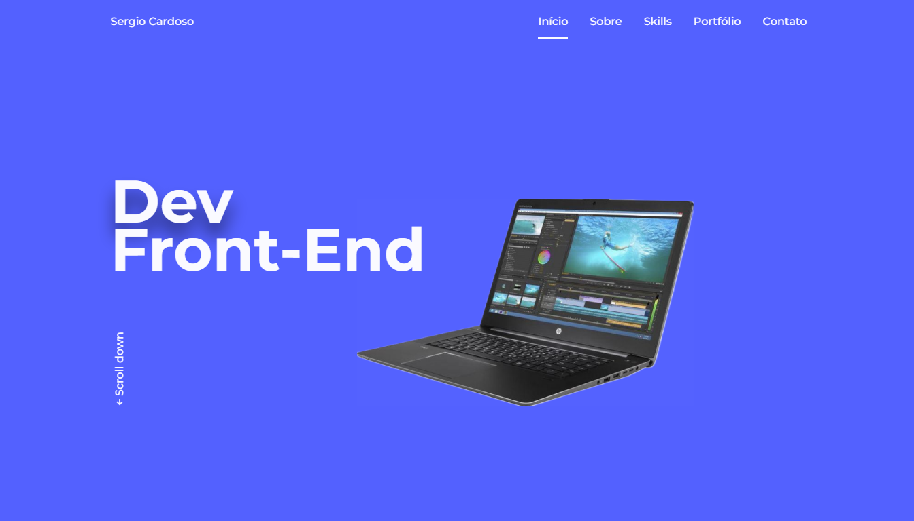

# Portfólio Website

> Este projeto portfólio foi criado com o intuito de demonstrar meu profissionalismo e habilidades técnicas, abrangendo um amplo conjunto de tecnologias. A seleção de trabalhos contidos aqui foi inserida para destacar minhas experiências e competências como desenvolvedor. 

### ⚙️ Ajustes e melhorias

O projeto encontra-se em fase final de desenvolvimento, as últimas atualizações serão focadas nas seguintes tarefas:

- [x] Página inicial
- [x] Página Sobre
- [x] Skills
- [x] Portfólio
- [x] Configurar WhatsApp
- [x] Configurar Telegram
- [x] Configurar e-mail
- [x] Página de Agradecimento
- [x] Alterar projetos do portifólio
- [ ] Atualizar seção 'skills'

## 💻 Tecnologias utilizadas

* HTML
* CSS
* SCSS
* Javascript

## 🔗 Acesse o website

https://sergioluiscardoso.github.io/portfolio-website/#

## 👨‍💻 Desenvolvedor

Idealizador do projeto:

<table>
  <tr>
    <td aligne ="center">
      <a href="#">
         
        
          <b>Sergio Cardoso</b>
        
      </a>
    </td>
    
  </tr>
</table>

## 📝 Licença

Esse projeto está sob licença. Veja o arquivo [LICENÇA](https://github.com/SergioLuisCardoso/portfolio-website/blob/main/LICENSE) para mais detalhes.

[⬆ Voltar ao topo](#portfólio-website) 

